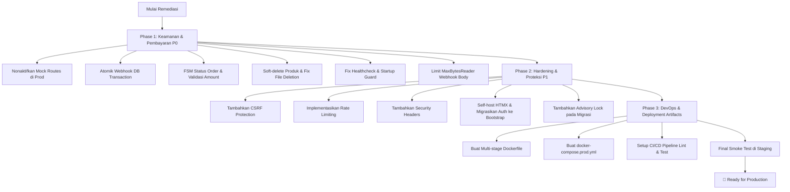

# Production Readiness Review: Sellora E-Commerce

**Tanggal Audit:** 2026-09-25  
**Auditor:** Engineering Review Team  
**Target:** Repositori Sellora (`single-vendor digital product commerce platform`)  
**Verdict:** 🛑 **NOT READY FOR PRODUCTION (BLOCKED)**

---

## 1. Ringkasan Eksekutif

Sellora telah dibangun dengan pondasi arsitektur yang sangat solid: struktur *modular monolith* yang bersih, pemisahan *domain layer*, *handler*, dan *repository*, penggunaan *server-rendered HTML* + HTMX yang efisien, hashing kata sandi dengan bcrypt, query database yang terparameterisasi dengan aman, serta kepatuhan terhadap sebagian besar panduan `AGENTS.md`.

Namun, audit mendalam menunjukkan bahwa sistem ini **belum siap untuk dirilis ke lingkungan produksi (*public-facing production with real monetary transactions*)**. Terdapat beberapa celah keamanan kritikal (*blocker*) pada alur pembayaran, integritas transaksional webhook, penanganan status pesanan, serta ketahanan operasional infrastruktur yang dapat dieksploitasi untuk mendapatkan produk digital secara gratis (*payment bypass*), menyebabkan inkonsistensi data, atau merusak file produk yang telah dibeli pelanggan.

---

## 2. Matriks Kesiapan Produksi (Readiness Scorecard)

| Pilar Evaluasi | Skor | Status | Catatan Utama |
| :--- | :---: | :---: | :--- |
| **Arsitektur & Kode** | 8.5 / 10 | 🟢 Baik | Modular monolith bersih, Chi router rapi, domain agnostic. |
| **Keamanan Pembayaran** | 4.0 / 10 | 🔴 Kritis | Sandbox bypass aktif di prod; amount tidak divalidasi; webhook non-atomik. |
| **Autentikasi & Otorisasi**| 7.0 / 10 | 🟡 Sedang | Bcrypt & session DB aman, tetapi tanpa CSRF token eksplisit & reset password. |
| **Penyimpanan & Unduhan** | 7.5 / 10 | 🟡 Sedang | Path traversal terlindungi, verifikasi order valid, namun `DeleteProduct` destruktif. |
| **Database & Transaksi** | 6.5 / 10 | 🟡 Sedang | Pool terkonfigurasi, namun webhook tanpa DB transaction & migrasi tanpa advisory lock. |
| **Ketahanan & Observabilitas**| 5.0 / 10 | 🔴 Kritis | `/healthz` false positive (return 200 saat DB mati); startup degraded state berbahaya. |
| **Performa & Frontend** | 6.5 / 10 | 🟡 Sedang | Tailwind CDN di auth; unpkg tanpa SRI; belum ada asset cache headers. |
| **Deployment & DevOps** | 3.0 / 10 | 🔴 Kritis | Tidak ada Dockerfile, compose, health probe realistis, atau pipeline CI/CD. |

**Skor Keseluruhan:** **6.0 / 10** (Status: **Membutuhkan Remediasi Sebelum Rilis**)

---

## 3. Temuan Kritis (P0 — Production Blockers)

Isu pada kategori ini wajib diperbaiki sebelum sistem menerima lalu lintas publik atau transaksi nyata.

### 3.1. Payment Bypass via Sandbox / Mock Checkout Routes di Lingkungan Produksi
- **Lokasi:** `internal/http/router.go:111-114`, `internal/order/handler.go:196-241`
- **Deskripsi:** Endpoint `/mock-checkout` dan `/mock-checkout/simulate` didaftarkan secara **tanpa syarat (unconditional)** di router, terlepas dari apakah `APP_ENV=production` atau `PAYMENT_PROVIDER=lynk`.
- **Dampak:** Pengguna mana pun yang memiliki pesanan `pending` dapat mengirimkan `POST /mock-checkout/simulate` dengan parameter `ref=ORD-xxx` dan `status=paid`. Handler secara langsung memanggil `orderService.UpdateOrderStatus(..., domain.StatusPaid, ...)` dan menandai pesanan lunas seketika tanpa melakukan pembayaran ke payment gateway eksternal.
- **Rekomendasi:**
  1. Daftarkan route `/mock-checkout*` hanya jika `!cfg.IsProduction() && cfg.PaymentProvider == "mock"`.
  2. Tolak `POST /mock-checkout/simulate` jika payment provider yang aktif bukan `mock`.
  3. Validasi di `config.Load()` agar di mode produksi (`APP_ENV=production`), `PAYMENT_PROVIDER` wajib bernilai provider nyata (misal `lynk`), bukan `mock`.

---

### 3.2. Ketiadaan Transaksi Database pada Pemrosesan Webhook (Inkonsistensi & Race Condition)
- **Lokasi:** `internal/payment/service.go:35-78`
- **Deskripsi:** Dalam fungsi `ProcessWebhook`, pembaruan status pesanan (`orderService.UpdateOrderStatus`) dan pencatatan event (`eventRepo.Record`) dieksekusi secara terpisah tanpa database transaction (`BeginTx`).
- **Pelanggaran Aturan:** Melanggar `AGENTS.md` Bagian 8 (*Transactions*):
  > *"Use database transactions for operations that must be atomic. Webhook processing: Payment Event + orders. A partially completed transaction must not leave the database in an invalid state."*
- **Dampak:** Jika `eventRepo.Record` gagal (misalnya karena gangguan koneksi DB atau pelanggaran constraint), status order sudah terlanjur berubah menjadi `paid` di tabel `orders` tanpa ada catatan di `payment_events`. Selain itu, dua webhook konkuren untuk event yang sama dapat lolos dari `eventRepo.Exists` sebelum salah satunya selesai merekam.
- **Rekomendasi:** Satukan update status pesanan dan `INSERT INTO payment_events` dalam satu transaksi PostgreSQL atomik.

---

### 3.3. Transisi Status Pesanan Tanpa Validasi State Awal & Tanpa Verifikasi Nominal (Amount)
- **Lokasi:** `internal/order/service.go:147-154`, `internal/payment/lynk.go:201-209`, `internal/domain/payment.go:28-36`
- **Deskripsi:**
  1. `orderService.UpdateOrderStatus` langsung menjalankan `UPDATE orders SET status = $1 ...` tanpa memeriksa status pesanan saat ini (*current state*). Jika pesanan sudah berstatus `paid`, webhook terlambat atau ulangan dengan status `failed` atau `cancelled` akan menimpa status pesanan menjadi gagal, mencabut akses unduhan pelanggan yang sah.
  2. Struct `domain.WebhookEvent` tidak menyertakan field `Amount`. Saat memproses webhook, sistem tidak memverifikasi apakah jumlah yang dibayarkan (`payload.Data.Amount`) sama persis dengan `order.TotalAmount`.
- **Dampak:** Kerentanan *state corruption* dan manipulasi nominal pembayaran (*underpayment fraud*).
- **Rekomendasi:**
  1. Terapkan *finite state machine* (FSM) untuk transisi pesanan:
     - `pending` $\rightarrow$ `paid`, `failed`, `cancelled`
     - `paid` $\rightarrow$ `refunded` (tidak boleh langsung ke `failed` atau `pending`)
     - State terminal (`failed`, `cancelled`, `refunded`) tidak dapat diubah kembali menjadi `paid`.
  2. Tambahkan `Amount` dan `Currency` ke `WebhookEvent` dan verifikasi kesesuaian nilai nominal terhadap total tagihan pesanan sebelum menandai pesanan lunas.

---

### 3.4. Penghapusan File Fisik Sebelum Transaksi DB pada `DeleteProduct` (Risiko Kehilangan Data Pembeli)
- **Lokasi:** `internal/product/service.go:236-248`
- **Deskripsi:** Pada method `DeleteProduct`:
  ```go
  for _, f := range product.Files {
      _ = s.storage.Delete(f.StoragePath)
  }
  return s.productRepo.Delete(ctx, id)
  ```
  File fisik di disk dihapus terlebih dahulu sebelum query `DELETE FROM products` dijalankan. Jika produk tersebut sudah pernah dibeli, tabel `order_items` memiliki *Foreign Key* `REFERENCES products(id)` (tanpa `ON DELETE CASCADE`), sehingga query `productRepo.Delete` dipastikan **gagal** karena *foreign key constraint violation*.
- **Dampak:** Produk gagal dihapus dari database, namun seluruh file biner digital di disk telah terhapus permanen. Pelanggan yang telah membayar produk tersebut tidak akan bisa mengunduh file mereka lagi (error 500 / file not found).
- **Rekomendasi:** Terapkan *soft delete* (*archive* status) untuk produk alih-alih *hard delete*, atau pastikan penghapusan fisik di disk hanya terjadi setelah transaksi penghapusan di database berhasil di-commit.

---

### 3.5. Healthcheck False Positive & Perilaku Startup Degraded yang Membahayakan Orchestrator
- **Lokasi:** `cmd/server/main.go:37-43`, `internal/http/router.go:57-77`
- **Deskripsi:**
  1. Di `cmd/server/main.go`, jika koneksi PostgreSQL gagal saat startup, server mencetak log peringatan dan tetap berjalan dengan semua service bernilai `nil`. Request yang masuk ke aplikasi akan berujung pada HTTP 404 atau pesan error internal.
  2. Endpoint `GET /healthz` selalu mengembalikan status code **HTTP 200 OK**, meskipun database `unreachable` atau `not configured`:
     ```go
     if err := deps.DB.PingContext(ctx); err != nil {
         dbStatus = "unreachable"
     }
     // Tetap mengembalikan HTTP 200 OK ke client
     ```
- **Dampak:** Cloud orchestrator (Kubernetes Pod Liveness/Readiness, AWS ECS/Target Group, GCP Cloud Run) menganggap instance sehat dan mengalirkan traffic pengguna ke kontainer yang sebenarnya lumpuh.
- **Rekomendasi:**
  1. Hentikan startup (`log.Fatalf`) jika database utama tidak dapat dihubungi saat boot di mode produksi.
  2. Kembalikan status **HTTP 503 Service Unavailable** pada `/healthz` jika database `PingContext` gagal.

---

### 3.6. Pembacaan Body Webhook Tanpa Batas Ukuran (Denial of Service / OOM Vulnerability)
- **Lokasi:** `internal/payment/lynk.go:146`, `internal/payment/mock.go:41`
- **Deskripsi:** Method `VerifyWebhook` memanggil `io.ReadAll(r.Body)` secara langsung tanpa pembatasan ukuran request body (`http.MaxBytesReader`).
- **Dampak:** Penyerang dapat mengirim payload berukuran raksasa (misal puluhan gigabyte) ke endpoint publik `/webhooks/lynk`, memicu kehabisan memori (*Out Of Memory Panic*) dan menjatuhkan seluruh server aplikasi.
- **Rekomendasi:** Batasi request body menggunakan `r.Body = http.MaxBytesReader(w, r.Body, 1<<20)` (maksimum 1 MB).

---

## 4. Temuan Prioritas Tinggi (P1 — High Risk)

### 4.1. Ketiadaan Proteksi CSRF (Cross-Site Request Forgery) Eksplisit
- **Lokasi:** Seluruh route `POST` di `internal/http/router.go`
- **Deskripsi:** Tidak ditemukan mekanisme CSRF token pada form HTML (`POST /login`, `POST /register`, `POST /checkout/{productID}`, `POST /admin/products/*`, dll.). Cookie sesi memang menggunakan atribut `SameSite: Lax`, namun `SameSite: Lax` tidak memberikan perlindungan penuh pada skenario navigasi *top-level*, interaksi dengan subdomain yang berbagi domain (*same-site subdomain attack*), atau browser legacy. `AGENTS.md` Bab 26 secara eksplisit mewajibkan mitigasi CSRF.
- **Rekomendasi:** Pasang middleware proteksi CSRF (seperti `gorilla/csrf` atau middleware double-submit cookie token yang kompatibel dengan Chi & HTMX via header `HX-CSRFToken`).

---

### 4.2. Ketiadaan Rate Limiting pada Endpoint Sensitif
- **Lokasi:** `internal/http/router.go`
- **Deskripsi:** Tidak ada mekanisme pembatasan laju (*rate limiting*) pada seluruh aplikasi.
- **Dampak:**
  - `/login` rentan terhadap serangan *brute force* dan *credential stuffing*.
  - `/register` rentan terhadap *account spamming*.
  - `/checkout/*` rentan terhadap pembuatan pesanan palsu (*order exhaustion*).
  - `/downloads/*` rentan terhadap pengurasan bandwidth server.
- **Rekomendasi:** Terapkan rate limiter middleware (misal `github.com/go-chi/httprate`) pada rute publik dan autentikasi.

---

### 4.3. Ketiadaan Security Response Headers
- **Lokasi:** `internal/http/router.go`
- **Deskripsi:** Response HTTP tidak menyertakan *header* keamanan esensial:
  - `X-Frame-Options: DENY` (mencegah *clickjacking* pada halaman pembayaran dan admin)
  - `X-Content-Type-Options: nosniff` (mencegah MIME-sniffing serangan file download)
  - `Referrer-Policy: strict-origin-when-cross-origin`
  - `Strict-Transport-Security` (HSTS untuk memastikan HTTPS di produksi)
  - `Content-Security-Policy` (CSP)
- **Rekomendasi:** Buat middleware security headers sederhana untuk menyematkan header di atas pada setiap response.

---

### 4.4. Penggunaan Tailwind CSS CDN di Halaman Autentikasi Produksi
- **Lokasi:** `web/templates/layouts/auth.html:8` (`https://cdn.tailwindcss.com`)
- **Deskripsi:** Layout `auth.html` memuat script CDN Tailwind JIT browser runtime. Tailwind secara resmi melarang penggunaan CDN ini untuk produksi karena:
  1. Melakukan kompilasi CSS di browser secara client-side, memperlambat rendering (FOUC - *Flash of Unstyled Content*).
  2. Ukuran file script besar (~3MB+ runtime).
  3. Inkonsistensi UI (storefront dan admin menggunakan Bootstrap 5, sedangkan auth menggunakan Tailwind).
- **Rekomendasi:** Selaraskan layout autentikasi menggunakan Bootstrap 5 yang sudah dibundel secara lokal di `/static/admin/libs/bootstrap/`, atau kompilasi CSS Tailwind statis saat build-time.

---

### 4.5. Dependensi CDN Eksternal untuk HTMX Tanpa Subresource Integrity (SRI)
- **Lokasi:** `web/templates/layouts/public.html:26`, `web/templates/layouts/admin.html:17`
- **Deskripsi:** Script HTMX diambil langsung dari `https://unpkg.com/htmx.org@1.9.12` tanpa atribut `integrity` hash.
- **Dampak:** Jika CDN unpkg mengalami downtime, latency tinggi, atau serangan *supply chain*, seluruh fungsi interaktif aplikasi akan lumpuh.
- **Rekomendasi:** Simpan file `htmx.min.js` di dalam direktori `web/static/` sehingga disajikan langsung dari server Sellora (self-hosted).

---

### 4.6. Variabel `SESSION_SECRET` Tidak Digunakan di Logika Autentikasi
- **Lokasi:** `internal/config/config.go:17,43`, `internal/auth/service.go`
- **Deskripsi:** `SESSION_SECRET` diwajibkan diisi saat `APP_ENV=production`. Namun, nilai ini tidak pernah digunakan sama sekali di kode manapun. Token sesi disimpan langsung dalam cookie sebagai token heksadesimal acak yang dicocokkan ke database.
- **Dampak:** Tidak membahayakan secara langsung karena token acak di DB sudah aman (*opaque bearer session*), namun menyisakan konfigurasi mubazir (*dead configuration*) yang membingungkan engineer perihal perlindungan *signed cookie*.
- **Rekomendasi:** Gunakan `SESSION_SECRET` untuk melakukan HMAC signing pada cookie sesi, atau hapus validasinya jika arsitektur yang dipilih adalah database opaque token.

---

### 4.7. Ketiadaan Advisory Lock pada Migrasi Database
- **Lokasi:** `internal/database/migrate.go`
- **Deskripsi:** `MigrateUp` memeriksa tabel `schema_migrations` tanpa menggunakan PostgreSQL advisory lock (`pg_advisory_lock`).
- **Dampak:** Jika server dideploy dalam arsitektur multi-instance / replica (misal horizontal autoscaling pada Kubernetes/ECS), instance yang boot secara bersamaan akan saling berebut menjalankan file migrasi SQL yang sama secara simultan, menyebabkan kegagalan deployment atau error constraint.
- **Rekomendasi:** Gunakan `SELECT pg_advisory_lock(...)` sebelum menjalankan migrasi dan `SELECT pg_advisory_unlock(...)` di akhir migrasi.

---

## 5. Temuan Prioritas Sedang (P2 — Medium / Technical Debt)

1. **Ketiadaan Fitur Reset Password / Forgot Password:**  
   Pelanggan maupun administrator yang lupa kata sandi tidak memiliki cara untuk memulihkan akun tanpa campur tangan langsung dari engineer via database SQL query.
2. **Kredensial Admin Hardcoded pada Seed Script (`cmd/seed/main.go`):**  
   Email `admin@sellora.local` dan password `AdminPassword123!` tertulis *hardcoded*. Jika script dijalankan di server staging/produksi, akun dengan password default yang mudah ditebak akan tercipta. Sebaiknya baca dari environment variable (`SEED_ADMIN_EMAIL`, `SEED_ADMIN_PASSWORD`).
3. **Akumulasi Sesi Kadaluarsa di Database:**  
   Method `sessionRepo.DeleteExpired` sudah diimplementasikan di `internal/auth/repository.go`, namun tidak pernah dipanggil di mana pun. Sesi yang telah lewat masa berlakunya akan menumpuk selamanya di PostgreSQL kecuali ada background worker pembersih.
4. **Ketiadaan Notifikasi Email Transaksional:**  
   Setelah pembayaran terverifikasi, pelanggan belum mendapatkan email konfirmasi invoice dan tautan unduhan (saat ini tercatat di `TODO.md`).
5. **Ketiadaan Header Caching pada File Statis:**  
   Handler `web/static/static.go` belum menyematkan header `Cache-Control: public, max-age=...` sehingga browser akan selalu meminta ulang aset statis pada setiap refresh.
6. **Potensi Masalah Skalabilitas pada Pencarian Katalog:**  
   Pencarian produk di `PostgresProductRepository.ListPublished` menggunakan `LOWER(name) LIKE $1` yang memaksa PostgreSQL melakukan *sequential scan*. Jika produk bertambah banyak, perlu indeks trigram (`pg_trgm`) atau full-text search.
7. **N+1 Query pada Daftar Produk Admin:**  
   Di `PostgresProductRepository.ListAll`, file produk diambil dengan melakukan query individual ke `product_files` dalam perulangan `for` setiap produk.

---

## 6. Aspek Positif & Kepatuhan Arsitektur

Berikut adalah hal-hal yang **sudah sangat baik dan memenuhi standar rekayasa perangkat lunak modern**:
- ✅ **Kepatuhan Terhadap Panduan `AGENTS.md`:** Tidak ada over-engineering, tidak ada microservices/event broker prematur; arsitektur modular monolith Go + Chi + HTMX + PostgreSQL diterapkan dengan konsisten.
- ✅ **Keamanan Database Terparameterisasi:** Seluruh query SQL menggunakan `$1, $2, ...`, tidak ditemukan celah SQL Injection di repository layer.
- ✅ **Otorisasi Unduhan Digital yang Ketat:** Endpoint `/downloads/{fileID}` memverifikasi kepemilikan pesanan (`HasAccessToProduct`) dan otentikasi pengguna sebelum mengalirkan file fisik.
- ✅ **Penyimpanan File Aman:** File produk disimpan di luar web root dengan nama heksadesimal acak bertipe `.bin`, direktori berbasis tahun/bulan, dan pengecekan proteksi *path traversal*.
- ✅ **Hashing Password Standar Industri:** Menggunakan `golang.org/x/crypto/bcrypt` dengan *cost* 12 dan *timing attack protection* pada kegagalan login.
- ✅ **Kualitas Kode & Race Safety:** Seluruh rangkaian tes lulus verifikasi:
  - `go test -race ./...` : **LULUS (0 race condition detected)**.
  - `go vet ./...` : **LULUS (0 issue)**.
  - Cakupan unit test mencapai 70–90% pada domain-domain inti.

---

## 7. Rencana Aksi Remediasi Menuju Production Ready



### Checklist Singkat Sebelum Go-Live:
1. [ ] Matikan rute `/mock-checkout` dan `/mock-checkout/simulate` pada lingkungan produksi.
2. [ ] Validasi nilai `Amount` pada webhook dan bungkus update status + event recording dalam satu `sql.Tx`.
3. [ ] Kunci transisi status pesanan agar pesanan yang sudah `paid` tidak bisa berubah menjadi `failed` atau `cancelled`.
4. [ ] Ubah status `/healthz` agar mengembalikan status HTTP 503 saat koneksi database terputus.
5. [ ] Batasi ukuran body webhook dengan `http.MaxBytesReader`.
6. [ ] Pasang perlindungan CSRF dan HTTP Security Headers.
7. [ ] Bundel library HTMX secara lokal dan hapus dependensi Tailwind CDN di `auth.html`.
8. [ ] Siapkan kontainerisasi (`Dockerfile` multi-stage berbasis Alpine/Distroless).

---
*Laporan ini disusun secara objektif berdasarkan inspeksi statis kode sumber, verifikasi eksekusi tes unit, serta pengujian logika keamanan sistem Sellora.*
